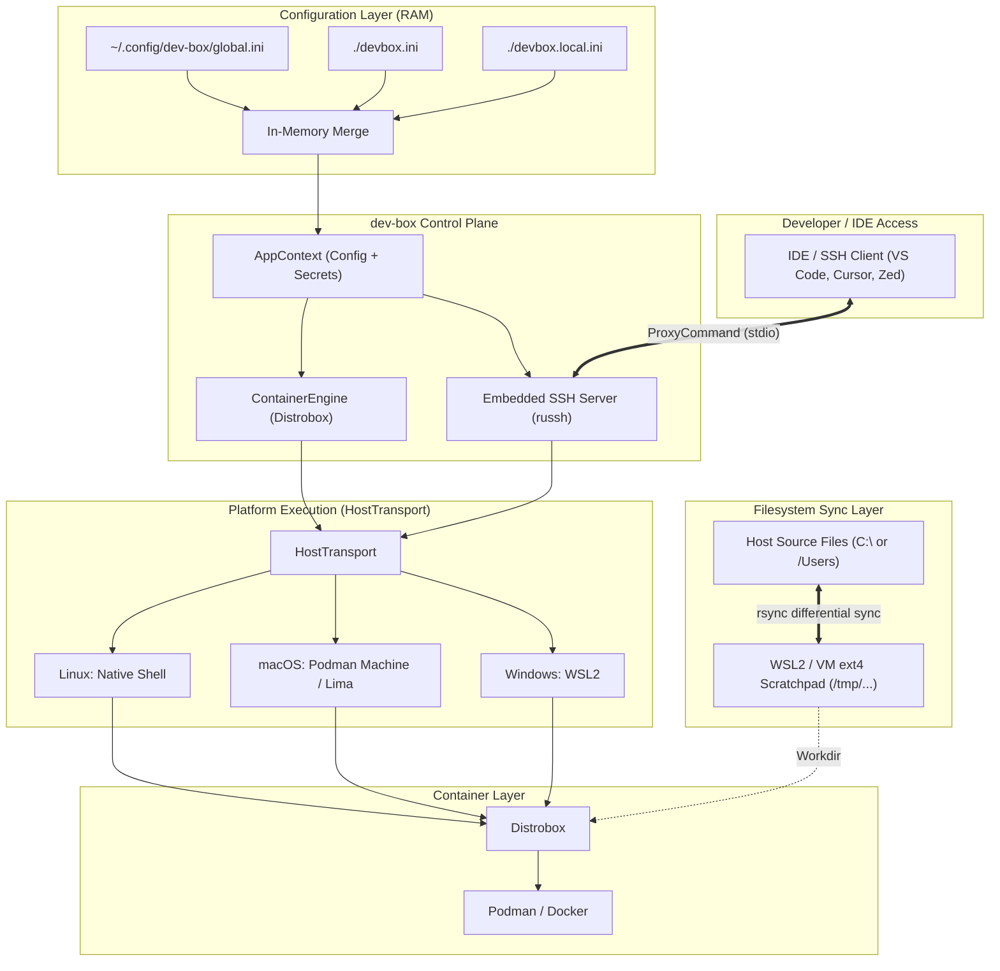

# dev-box

[](https://github.com/srikanthrayudu/dev-box/releases)
[](#status)
[](LICENSE)
[](https://crates.io/crates/dev-box)

> ⚠️ **Project Status: Early Development / Active Alpha**  
> `dev-box` is currently in active development. Core orchestration, keyless SSH proxying, and scratchpad sync are working, but CLI interfaces and features may evolve rapidly before the `v1.0` stable release.

**dev-box** is a fast, IDE-independent developer environment orchestrator built on top of [Distrobox](https://distrobox.it).

Unlike VS Code's Dev Containers, dev-box doesn't lock you into a specific editor. It's a small, single Rust binary that merges layered configuration and drives Distrobox to create reproducible, isolated Linux dev environments on any platform — with **zero SSH key setup, native filesystem performance, and IDE freedom**.

## 🚀 Quick Start (30 seconds)

Install the pre-built binary:

```sh
# Linux / macOS / Windows (from GitHub Releases)
curl -L https://github.com/srikanthrayudu/dev-box/releases/download/latest/dev-box-$(uname -s | tr '[:upper:]' '[:lower:]') \
  -o /tmp/dev-box && chmod +x /tmp/dev-box && sudo mv /tmp/dev-box /usr/local/bin/
```

Create a project config:

```sh
cd your-project
cat > devbox.ini << 'EOF'
[dev-environment]
name = "my-dev"
image = "ubuntu:24.04"
additional_packages = "git curl build-essential"
EOF
```

Boot your environment:

```sh
dev-box up          # Creates container, wires up SSH
ssh my-dev          # Instant keyless connection from any IDE
```

That's it. Open VS Code Remote-SSH, Cursor, JetBrains Gateway, or Neovim, point to `my-dev`, and code. **No keys generated. No setup inside the box. No vendor lock-in.**

---

## Why dev-box?

- **IDE-independent** — no proprietary extension or vendor lock-in. Use Neovim, VS Code, JetBrains, Emacs, or a plain terminal.
- **Cross-platform** — the same config works on Linux, macOS, and Windows. dev-box abstracts away *how* each host reaches the underlying Linux container layer.
- **Layered configuration** — cascade settings from system defaults, to your personal preferences, to the project, to local overrides — without editing a single shared file or fighting Git merge conflicts.
- **100% native I/O speed (Scratchpad Sync)** — bypass the slow Windows 9P (`/mnt/c/`) and macOS VirtioFS filesystem penalties. Code is edited natively on the host while builds compile in native ext4.
- **Zero bloat** — dev-box doesn't reinvent container runtimes. It's a thin, sub-millisecond-startup control plane over Distrobox and Podman/Docker, so it stays a tiny (~2MB) static binary.
- **No SSH keys at all** — dev-box embeds its own tiny SSH server directly in the binary. `dev-box up` wires up your local SSH client; nothing is ever installed, generated, or modified inside the box.

## 📊 How dev-box compares

| Feature | dev-box | VS Code Dev Containers | Nix devshell | devenv.sh |
|---------|---------|---|---|---|
| **IDE-independent** | ✅ Yes | ❌ VS Code only | ✅ Any editor | ✅ Any editor |
| **Embedded SSH** (no setup) | ✅ Yes | ❌ Requires extension | ❌ No | ❌ No |
| **Single binary** | ✅ ~2MB | ❌ Heavyweight | ❌ Complex toolchain | ❌ Complex toolchain |
| **Cross-platform config** | ✅ Linux/Mac/Windows | ✅ Linux/Mac/Windows | ❌ NixOS-focused | ✅ Yes, but... |
| **Layered config** | ✅ Global/Team/Project | ❌ `.devcontainer/` only | ✅ Flakes | ✅ Yes |
| **Native filesystem speed** (Windows/Mac) | ✅ Scratchpad Sync | ❌ Volume mounts slow | ⚠️ Mixed | ⚠️ Mixed |
| **Built on familiar tools** | ✅ Distrobox + SSH | ❌ Docker proprietary | ❌ Nix learning curve | ⚠️ Custom DSL |

## 📚 Example Repositories

Get started instantly by cloning an example and running `dev-box up`:

- **[dev-box-example-rust](https://github.com/srikanthrayudu/dev-box-example-rust)** — Rust + Cargo + clippy + miri, ready to code
- **[dev-box-example-python](https://github.com/srikanthrayudu/dev-box-example-python)** — Python 3.12 + Poetry + ruff + pytest
- **[dev-box-example-node](https://github.com/srikanthrayudu/dev-box-example-node)** — Node.js + pnpm + TypeScript + ESLint

Each example is a 1-minute setup: clone → `dev-box up` → connect from your IDE.

---

## Architecture



- **Config engine** (`src/config`): merges N INI layers in memory. Scalar keys (like `image`) are overwritten by later layers; additive keys (`additional_packages`, `init_hooks`, `exported_apps`, `forward_env`) are space-joined.
- **HostTransport** (`src/host`): abstracts *how* dev-box reaches the Linux layer that runs Distrobox — native shell on Linux, `wsl.exe` on Windows, and `podman machine ssh` / `limactl` on macOS.
- **ContainerEngine** (`src/engine`): drives container lifecycle (`assemble`, `enter`, `list`, `stop`, `rm`) using `HostTransport` as its execution bridge.
- **Embedded SSH server** (`src/sshd`): an embedded SSH server built into the binary that speaks the SSH protocol directly over stdio (via `ProxyCommand`), providing keyless, zero-credential access to the box.
- **Scratchpad Sync** (`src/host/scratchpad.rs`): differentially syncs project files between host storage (`C:\` or `/Users`) and a high-speed native ext4 RAM/disk workspace to eliminate cross-filesystem slowdown.

### How the keyless SSH connection actually works

`ssh`'s `ProxyCommand` directive can hand the entire SSH protocol off to *any* subprocess's stdin/stdout instead of a TCP socket. `dev-box ssh-proxy <box>` *is* that subprocess: it's a tiny SSH server baked into the binary.


There is **no TCP listener and no network exposure** at any point — the only way to reach `dev-box ssh-proxy` is to already be the local user who can run `distrobox enter`. That's what makes the following security properties possible:

- **No host keys to trust**: the server generates a fresh key in memory on every connection and never writes it to disk. MITM is impossible on a pipe you spawned yourself, so the generated client config is safe by default.
- **No user keys or passwords at all**: dev-box's embedded server accepts the SSH `"none"` authentication method unconditionally. OpenSSH clients always probe with `"none"` automatically before ever prompting, so you're already authenticated by the kernel (you own the process).
- **Nothing is installed or changed inside the box**: there's no `sshd`, no `authorized_keys`, no package install. `dev-box ssh-proxy` simply runs `distrobox enter <box>` (or a specific command, for `scp`/`rsync`/port-forward).

Because the client side is just a normal `ssh` config entry, any tool that shells out to `ssh` — VS Code Remote-SSH, JetBrains Gateway, plain `ssh`/`scp`, etc. — works without modification. No extensions needed. No IDE-specific glue code.

## Configuration layering

dev-box merges configuration from multiple INI files, in ascending priority order. By default:

1. `~/.config/dev-box/global.ini` — your personal defaults, shared across every project (editor tools, shell aliases, dotfile hooks).
2. `./devbox.ini` — the project's own configuration, committed to the repo and shared with your team.
3. `./devbox.local.ini` — local-only overrides (gitignored) for machine-specific tweaks or experiments.

Example `devbox.ini`:

```ini
[dev-environment]
name = "my-project-dev"
image = "ubuntu:24.04"
additional_packages = "git curl build-essential"
init_hooks = "echo 'dev-box environment ready'"
```

Scalar fields like `image` or `name` are overwritten by the highest-priority layer that sets them. List-like fields (`additional_packages`, `init_hooks`, `exported_apps`, `forward_env`) are space-joined, so later layers **add** to earlier ones.

You can also pass explicit layers, stacked in the order given:

```sh
dev-box -c base.ini -c team.ini -c my-overrides.ini up
```

## Host integration: git, AI agent CLIs, and API keys

dev-box is a thin orchestration layer over Distrobox, so it inherits Distrobox's own host-integration model rather than reinventing one. Concretely:

- **Git credentials, SSH keys, and most CLI config files are already there for free.** Distrobox bind-mounts your real `$HOME` into the box by default, so `~/.gitconfig`, `~/.ssh`, `~/.git-credentials`, and all your dotfiles are instantly available.
- **AI agent (or any other) CLI already installed under `$HOME`** (e.g. `~/.local/bin`, `~/.cargo/bin`, a global npm prefix under `$HOME`) is visible the same way, as long as it's a binary compatible with the container's architecture.
- **API keys that live only in an environment variable** (no config file) are the one thing that isn't automatically shared, since env vars aren't part of `$HOME`. Declare the variable *names* you want forwarded:

  ```ini
  [dev-environment]
  forward_env = "OPENAI_API_KEY ANTHROPIC_API_KEY GITHUB_TOKEN"
  ```

  Only the names are ever written to `devbox.ini` (safe to commit). Each time you run `dev-box up`, `dev-box enter`, or connect via `ssh`, dev-box reads the *current* value of each named variable from the host and passes it through to the box.

  Note: forwarded values must not contain literal spaces (a safe assumption for API keys/tokens), and — since this passes through several process command lines — they're visible to `ps` on your own machine (standard SSH behavior, not a dev-box weakness).

## Fast filesystem performance: Scratchpad Sync (Windows & macOS)

When developing inside Linux containers on Windows (WSL2) or macOS (Podman Machine/Lima), compiling files stored on the host filesystem (`C:\...` via 9P or `/Users/...` via VirtioFS) introduces a **5x–10x slowdown** on heavy I/O (cargo builds, npm installs, postgres index creation, etc.).

Standard Dev Containers solve this by burying code inside opaque Docker Named Volumes, which locks files away from native Windows/Mac tools.

**dev-box provides the best of both worlds with built-in Scratchpad Sync**:

```
┌─────────────────────────────────────────────────────────────┐
│                    HOST FILESYSTEM (C:\ or /Users)          │
│  Project Source Files (Edited natively with your tools)     │
└──────────────────────────────┬──────────────────────────────┘
                               │
            Differential Sync (native WSL / VM rsync)
            Sub-millisecond latency across boundary
                               │
┌──────────────────────────────▼──────────────────────────────┐
│                NATIVE LINUX EXT4 RAM/RAMDISK                │
│  `/tmp/dev-box/scratchpads/<box_name>/`                     │
│  • Primary workspace for Distrobox container                │
│  • Compiles at NATIVE 100% Linux ext4 speed                 │
└─────────────────────────────────────────────────────────────┘
```

- **Source files stay on your host**: Use Windows Git tools, host linters, and native editors without network protocols.
- **100% native ext4 compilation**: Builds (`cargo build`, `npm install`) run entirely inside the VM's native ext4 storage.
- **Automatic `.gitignore` & artifact isolation**: Heavy directories (`target/`, `node_modules/`, `.git/`) stay in Linux and never cross the slow bridge.
- **Auto-sync on exit**: Modified source files (e.g. `Cargo.lock`, code generators) automatically sync back to the host when you exit your session.
- **Enable via CLI or config**: Run `dev-box enter --scratchpad` or add `scratchpad = true` to `devbox.ini`. Manual sync is available via `dev-box sync` and `dev-box sync --reverse`.

See the [Filesystem Performance Guide](docs/filesystem-performance.md) for full benchmarks and architecture details.

## Usage

```sh
# Create/update the environment from the merged configuration,
# and configure keyless SSH access to it in one step (alias: `dev-box create`)
dev-box up

# Preview the merged configuration without touching any containers
dev-box up --dry-run

# List existing dev-box / distrobox containers (alias: `dev-box ls`)
dev-box list

# Enter an assembled environment directly (uses [dev-environment] name= by default)
dev-box enter
dev-box enter my-other-box

# On Windows: enter inside a high-speed native WSL2 ext4 scratchpad (100% Linux compilation speed)
dev-box enter --scratchpad

# Synchronize files between host and WSL2 scratchpad on Windows
dev-box sync            # push host changes to WSL scratchpad
dev-box sync --reverse  # pull scratchpad changes back to host

# Stop an environment (uses [dev-environment] name= by default)
dev-box stop
dev-box stop my-other-box

# Remove an environment and clean up its SSH configuration and scratchpad (alias: `dev-box delete`)
dev-box rm
dev-box rm --force my-other-box

# Print the merged configuration only
dev-box config

# Or just use plain ssh -- dev-box already wired up ~/.ssh/config for you
ssh my-project-dev
```

Any Remote-SSH-capable IDE (VS Code, Cursor, JetBrains Gateway, Zed, ...) can connect to `my-project-dev` as soon as `dev-box up` has run once — no extension, no manual key setup, no host to configure.

> `dev-box ssh-proxy` is a hidden subcommand used internally as the generated `ProxyCommand`. You should never need to run it by hand.

## Detailed Documentation

- **[IDE Integration & Keyless SSH Guide](docs/ide-integration.md)** — Complete setup for VS Code, Cursor, JetBrains Gateway, Zed, and Neovim; port forwarding; and zero-credential authentication mechanics.
- **[Filesystem Performance & Scratchpad Sync Guide](docs/filesystem-performance.md)** — In-depth analysis of Windows 9P vs macOS VirtioFS vs Linux native ext4, why Docker volumes fall short, and how to measure your own rig.

## Requirements

- [Distrobox](https://distrobox.it) and either Podman or Docker, reachable from the platform-appropriate layer:
  - **Linux**: installed natively.
  - **macOS**: installed inside a running [Podman Machine](https://podman.io) or [Lima](https://lima-vm.io) instance.
  - **Windows**: installed inside [WSL2](https://learn.microsoft.com/windows/wsl/).
- The OpenSSH **client** (just `ssh`, no server) on the host, to actually connect. This ships by default on Linux and macOS, and as an optional Windows feature (already required by any Remote-SSH IDE).

> **Filesystem Performance Note**: Developing on Windows NTFS (`C:\...`) or macOS APFS across VM boundaries can slow down heavy builds (`cargo build`, `npm install`). Use `dev-box enter --scratchpad` to keep source files on your host and compile in native Linux ext4 instead. See [Filesystem Performance Guide](docs/filesystem-performance.md).

## Installing

### Pre-built Binaries (Recommended)

Pre-built binaries for Linux, macOS, and Windows are published on the [GitHub Releases](https://github.com/srikanthrayudu/dev-box/releases) page for every tagged version. Download the binary for your platform and put it on your `PATH`:

```sh
# Linux
curl -L https://github.com/srikanthrayudu/dev-box/releases/download/v0.1.0/dev-box-linux-x86_64 \
  -o /tmp/dev-box && chmod +x /tmp/dev-box && sudo mv /tmp/dev-box /usr/local/bin/

# macOS (Intel)
curl -L https://github.com/srikanthrayudu/dev-box/releases/download/v0.1.0/dev-box-macos-x86_64 \
  -o /tmp/dev-box && chmod +x /tmp/dev-box && sudo mv /tmp/dev-box /usr/local/bin/

# macOS (Apple Silicon)
curl -L https://github.com/srikanthrayudu/dev-box/releases/download/v0.1.0/dev-box-macos-aarch64 \
  -o /tmp/dev-box && chmod +x /tmp/dev-box && sudo mv /tmp/dev-box /usr/local/bin/

# Windows (PowerShell)
$ProgressPreference = 'SilentlyContinue'
Invoke-WebRequest -Uri 'https://github.com/srikanthrayudu/dev-box/releases/download/v0.1.0/dev-box-windows-x86_64.exe' `
  -OutFile "$env:USERPROFILE\dev-box.exe"
# Add to PATH as needed
```

### From Crates.io

```sh
cargo install dev-box
```

### Build from Source

You'll need a [Rust toolchain](https://rustup.rs):

```sh
git clone https://github.com/srikanthrayudu/dev-box
cd dev-box
cargo build --release
```

The resulting binary will be at `target/release/dev-box` (or `dev-box.exe` on Windows).

## Roadmap

- Real pseudo-terminal allocation for the embedded SSH server, so full-screen interactive tools work correctly over `ssh box`.
- Additional `ContainerEngine` backends beyond Distrobox (Docker Compose, Podman Compose).
- Enforced/locked configuration keys for team- or org-level policy layers.
- GUI/TUI for config management and container lifecycle (macOS/Linux/Windows).
- Built-in telemetry opt-in for usage analytics and crash reporting.

## Contributing

We welcome contributions! Here's how to get started:

1. **Fork & clone** the repo
2. **Read** [CONTRIBUTING.md](CONTRIBUTING.md) for development setup
3. **Pick** a [good first issue](https://github.com/srikanthrayudu/dev-box/issues?q=is%3Aissue+is%3Aopen+label%3A%22good+first+issue%22) or propose a feature
4. **Submit a PR** — we review actively

### Areas we're looking for help

- Platform-specific testing (macOS with Lima, Windows with WSL2)
- Example repos and documentation
- IDE integration guides (Helix, Zed, others)
- Rust quality-of-life improvements (error handling, logging, tests)

## Community & Support

- **GitHub Discussions** — Ask questions and share your dev-box setups
- **GitHub Issues** — Report bugs and request features
- **Twitter/X** — [@srikanthrayudu](https://twitter.com/srikanthrayudu)

## Acknowledgments

- [Distrobox](https://distrobox.it) — the container orchestration foundation
- [russh](https://github.com/warp-tech/russh) — embedded SSH server library
- The Rust community and open-source ecosystem

## License

MIT — see [LICENSE](LICENSE).
