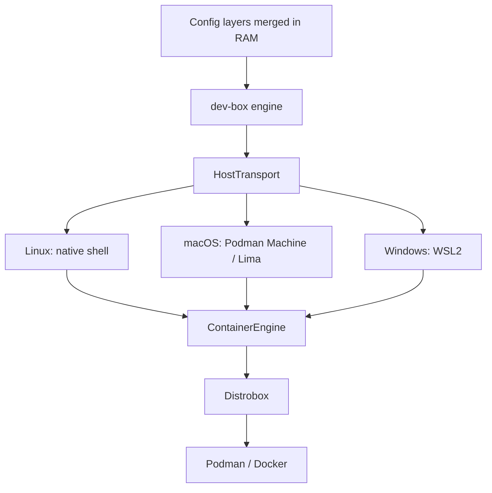

# dev-box

[](https://github.com/srikanthrayudu/dev-box/releases)
[](#status)
[](LICENSE)

> ⚠️ **Project Status: Early Development / Active Alpha**  
> `dev-box` is currently in active development. Core orchestration, keyless SSH proxying, and scratchpad sync are working, but CLI interfaces and features may evolve rapidly before the `v1.0` stable release. Feedback, issues, and contributions are welcome!

**dev-box** is a fast, IDE-independent developer environment orchestrator built on top of [Distrobox](https://distrobox.it).

Unlike VS Code's Dev Containers, dev-box doesn't lock you into a specific editor. It's a small, single Rust binary that merges layered configuration and drives Distrobox to create reproducible, isolated dev environments — on Linux natively, on macOS via Podman Machine/Lima, and on Windows via WSL2. Any editor or IDE with remote/SSH support can connect to the resulting environment.

## Why dev-box?

- **IDE-independent** — no proprietary extension or vendor lock-in. Use Neovim, VS Code, JetBrains, Emacs, or a plain terminal.
- **Cross-platform** — the same config works on Linux, macOS, and Windows. dev-box abstracts away *how* each host reaches the underlying Linux container layer.
- **Layered configuration** — cascade settings from system defaults, to your personal preferences, to the project, to local overrides — without editing a single shared file or fighting Git merge conflicts.
- **100% native I/O speed (Scratchpad Sync)** — bypass the slow Windows 9P (`/mnt/c/`) and macOS VirtioFS filesystem penalties. Code is edited natively on the host while builds compile in native ext4 RAM/disk, without burying files inside opaque Docker volumes.
- **Zero bloat** — dev-box doesn't reinvent container runtimes. It's a thin, sub-millisecond-startup control plane over Distrobox and Podman/Docker, so it stays a tiny (~2MB) static binary.
- **No SSH keys at all** — dev-box embeds its own tiny SSH server directly in the binary. `dev-box up` wires up your local SSH client; nothing is ever installed, generated, or modified inside the box, and no host or user key ever exists anywhere.

## Architecture



- **Config engine** (`src/config`): merges N INI layers in memory. Scalar keys (like `image`) are overwritten by later layers; additive keys (`additional_packages`, `init_hooks`, `exported_apps`) are combined across layers.
- **HostTransport** (`src/host`): abstracts *how* dev-box reaches the Linux layer that runs Distrobox — native shell on Linux, `wsl.exe` on Windows, `podman machine ssh` / `limactl` on macOS.
- **ContainerEngine** (`src/engine`): abstracts the container backend. Only `DistroboxEngine` exists today, but the trait leaves room for alternative backends later.
- **Embedded SSH server** (`src/sshd`): a minimal SSH server built into the `dev-box` binary itself, plus the local `~/.ssh/config` entry that makes `ssh <box-name>` (and any IDE built on top of it) just work.

### How the keyless SSH connection actually works

`ssh`'s `ProxyCommand` directive can hand the entire SSH protocol off to *any* subprocess's stdin/stdout instead of a TCP socket. `dev-box ssh-proxy <box>` *is* that subprocess: it's a tiny SSH server (built with [`russh`](https://github.com/warp-tech/russh)) that speaks the protocol directly over its own stdio.


There is **no TCP listener and no network exposure** at any point — the only way to reach `dev-box ssh-proxy` is to already be the local user who can run `distrobox enter`. That's what makes the following safe:

- **No host keys to trust**: the server generates a fresh key in memory on every connection and never writes it to disk. MITM is impossible on a pipe you spawned yourself, so the generated client config sets `StrictHostKeyChecking no` / `UserKnownHostsFile no` without weakening anything.
- **No user keys or passwords at all**: dev-box's embedded server accepts the SSH `"none"` authentication method unconditionally. OpenSSH clients always probe with `"none"` automatically before ever trying a key or password, so authentication succeeds instantly and no credential of any kind is ever generated, stored, or requested.
- **Nothing is installed or changed inside the box**: there's no `sshd`, no `authorized_keys`, no package install. `dev-box ssh-proxy` simply runs `distrobox enter <box>` (or a specific command, for `ssh box command` / `scp`-style exec) and pipes its stdio through the SSH channel.

Because the client side is just a normal `ssh` config entry, any tool that shells out to `ssh` — VS Code Remote-SSH, JetBrains Gateway, plain `ssh`/`scp`, etc. — works without modification. Note: dev-box doesn't yet allocate a real pseudo-terminal for the child process, so full-screen interactive tools (vim, htop, ...) may not render perfectly yet; plain shells and most CLI workflows work fine (see [Roadmap](#roadmap)).

## Configuration layering

dev-box merges configuration from multiple INI files, in ascending priority order. By default:

1. `~/.config/dev-box/global.ini` — your personal defaults, shared across every project (editor tools, shell aliases, dotfile hooks).
2. `./devbox.ini` — the project's own configuration, committed to the repo and shared with your team.
3. `./devbox.local.ini` — local-only overrides (gitignored) for machine-specific tweaks or experiments.

Example `devbox.ini`:

```ini
[dev-environment]
name = "my-project-dev"
image = "ubuntu:24.04"
additional_packages = "git curl build-essential"
init_hooks = "echo 'dev-box environment ready'"
```

Scalar fields like `image` or `name` are overwritten by the highest-priority layer that sets them. List-like fields (`additional_packages`, `init_hooks`, `exported_apps`, `forward_env`) are space-joined across every layer that sets them, so your personal tools and the project's requirements both end up in the final environment.

You can also pass explicit layers, stacked in the order given:

```sh
dev-box -c base.ini -c team.ini -c my-overrides.ini up
```

## Host integration: git, AI agent CLIs, and API keys

dev-box is a thin orchestration layer over Distrobox, so it inherits Distrobox's own host-integration model rather than reinventing one. Concretely:

- **Git credentials, SSH keys, and most CLI config files are already there for free.** Distrobox bind-mounts your real `$HOME` into the box by default, so `~/.gitconfig`, `~/.ssh`, `~/.git-credentials`, `gh`'s stored token, and any AI agent CLI's config file (most store their key under `~/.config/<tool>/...`) are already visible inside the box the moment it starts. No dev-box code involved.
- **AI agent (or any other) CLI already installed under `$HOME`** (e.g. `~/.local/bin`, `~/.cargo/bin`, a global npm prefix under `$HOME`) is visible the same way, as long as it's a binary compatible with the box's OS/libc (a statically linked Go/Rust/Node-based CLI almost always is; a glibc-linked binary built for a very different host distro might not be). If you hit compatibility issues, the more robust fix is to just install the tool directly inside the box via `additional_packages` or `init_hooks` in `devbox.ini`, guaranteeing it matches the box's own libraries.
- **API keys that live only in an environment variable** (no config file) are the one thing that isn't automatically shared, since env vars aren't part of `$HOME`. Declare the variable *names* you want forwarded with `forward_env` in `devbox.ini`:

  ```ini
  [dev-environment]
  forward_env = "OPENAI_API_KEY ANTHROPIC_API_KEY GITHUB_TOKEN"
  ```

  Only the names are ever written to `devbox.ini` (safe to commit). Each time you run `dev-box up`, `dev-box enter`, or connect via `ssh`, dev-box reads the *current* value of each named variable from whatever shell you're running in and forwards it straight into that session via `distrobox enter --additional-flags "--env NAME=value"` -- never baked into the container image, never written to disk. If a variable isn't set in your shell, dev-box skips it with a warning instead of failing.

  Note: forwarded values must not contain literal spaces (a safe assumption for API keys/tokens), and -- since this passes through several process command lines -- they're visible to `ps` on your own machine for the moment the command runs, same as writing `MY_VAR=secret some-command` directly in a shell.

## Fast filesystem performance: Scratchpad Sync (Windows & macOS)

When developing inside Linux containers on Windows (WSL2) or macOS (Podman Machine/Lima), compiling files stored on the host filesystem (`C:\...` via 9P or `/Users/...` via VirtioFS) introduces a **5x to 20x cross-boundary I/O penalty**.

Standard Dev Containers solve this by burying code inside opaque Docker Named Volumes, which locks files away from native Windows/Mac tools.

**dev-box provides the best of both worlds with built-in Scratchpad Sync**:

```
┌─────────────────────────────────────────────────────────────┐
│                    HOST FILESYSTEM (C:\ or /Users)          │
│  Project Source Files (Edited natively with your tools)     │
└──────────────────────────────┬──────────────────────────────┘
                               │
            Differential Sync (native WSL / VM rsync)
            Sub-millisecond latency across boundary
                               │
┌──────────────────────────────▼──────────────────────────────┐
│                NATIVE LINUX EXT4 RAM/RAMDISK                │
│  `/tmp/dev-box/scratchpads/<box_name>/`                     │
│  • Primary workspace for Distrobox container                │
│  • Compiles at NATIVE 100% Linux ext4 speed                 │
└─────────────────────────────────────────────────────────────┘
```

- **Source files stay on your host**: Use Windows Git tools, host linters, and native editors without network protocols.
- **100% native ext4 compilation**: Builds (`cargo build`, `npm install`) run entirely inside the VM's native ext4 storage.
- **Automatic `.gitignore` & artifact isolation**: Heavy directories (`target/`, `node_modules/`, `.git/`) stay in Linux and never cross the slow bridge.
- **Auto-sync on exit**: Modified source files (e.g. `Cargo.lock`, code generators) automatically sync back to the host when you exit your session.
- **Enable via CLI or config**: Run `dev-box enter --scratchpad` or add `scratchpad = true` to `devbox.ini`. Manual sync is available via `dev-box sync` and `dev-box sync --reverse`.

See the [Filesystem Performance Guide](docs/filesystem-performance.md) for full benchmarks and architecture details.

## Usage

```sh
# Create/update the environment from the merged configuration,
# and configure keyless SSH access to it in one step (alias: `dev-box create`)
dev-box up

# Preview the merged configuration without touching any containers
dev-box up --dry-run

# List existing dev-box / distrobox containers (alias: `dev-box ls`)
dev-box list

# Enter an assembled environment directly (uses [dev-environment] name= by default)
dev-box enter
dev-box enter my-other-box

# On Windows: enter inside a high-speed native WSL2 ext4 scratchpad (100% Linux compilation speed)
dev-box enter --scratchpad

# Synchronize files between host and WSL2 scratchpad on Windows
dev-box sync            # push host changes to WSL scratchpad
dev-box sync --reverse  # pull scratchpad changes back to host

# Stop an environment (uses [dev-environment] name= by default)
dev-box stop
dev-box stop my-other-box

# Remove an environment and clean up its SSH configuration and scratchpad (alias: `dev-box delete`)
dev-box rm
dev-box rm --force my-other-box

# Print the merged configuration only
dev-box config

# Or just use plain ssh -- dev-box already wired up ~/.ssh/config for you
ssh my-project-dev
```

Any Remote-SSH-capable IDE (VS Code, Cursor, JetBrains Gateway, Zed, ...) can connect to `my-project-dev` as soon as `dev-box up` has run once — no extension, no manual key setup, no host to configure. See [IDE Integration Guide](docs/ide-integration.md) for step-by-step connection instructions.

> `dev-box ssh-proxy` is a hidden subcommand used internally as the generated `ProxyCommand`. You should never need to run it by hand.

## Detailed Documentation

- **[IDE Integration & Keyless SSH Guide](docs/ide-integration.md)** — Complete setup for VS Code, Cursor, JetBrains Gateway, Zed, and Neovim; port forwarding; and zero-credential authentication mechanics.
- **[Filesystem Performance & Scratchpad Sync Guide](docs/filesystem-performance.md)** — In-depth analysis of Windows 9P vs macOS VirtioFS vs Linux native ext4, why Docker volumes fall short, and how the `dev-box` Scratchpad Sync layer delivers 100% Linux compilation speed.

## Requirements

- [Distrobox](https://distrobox.it) and either Podman or Docker, reachable from the platform-appropriate layer:
  - **Linux**: installed natively.
  - **macOS**: installed inside a running [Podman Machine](https://podman.io) or [Lima](https://lima-vm.io) instance.
  - **Windows**: installed inside [WSL2](https://learn.microsoft.com/windows/wsl/).
- The OpenSSH **client** (just `ssh`, no server) on the host, to actually connect. This ships by default on Linux and macOS, and as an optional Windows feature (already required by any Remote-SSH IDE workflow).

> **Filesystem Performance Note**: Developing on Windows NTFS (`C:\...`) or macOS APFS across VM boundaries can slow down heavy builds (`cargo build`, `npm install`). Use `dev-box enter --scratchpad` or set `scratchpad = true` in `devbox.ini` to run in native ext4 RAM/disk. See [Filesystem Performance Guide](docs/filesystem-performance.md) for full details.


## Installing

Pre-built binaries for Linux, macOS, and Windows are published on the [GitHub Releases](../../releases) page for every tagged version. Download the binary for your platform and put it on your `PATH`.

To build from source, you'll need a [Rust toolchain](https://rustup.rs):

```sh
cargo build --release
```

The resulting binary will be at `target/release/dev-box` (or `dev-box.exe` on Windows).

## Roadmap

- Real pseudo-terminal allocation for the embedded SSH server, so full-screen interactive tools work correctly over `ssh box`.
- Additional `ContainerEngine` backends beyond Distrobox.
- Enforced/locked configuration keys for team- or org-level policy layers.

## License

MIT — see [LICENSE](LICENSE).
