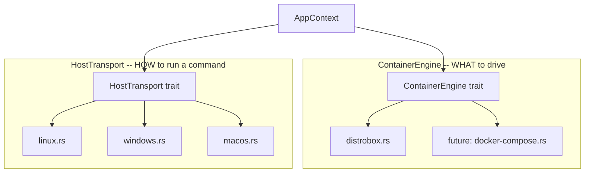
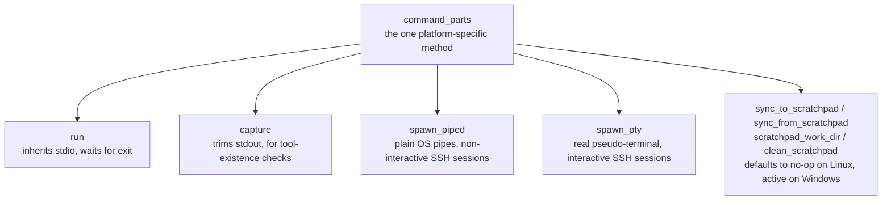
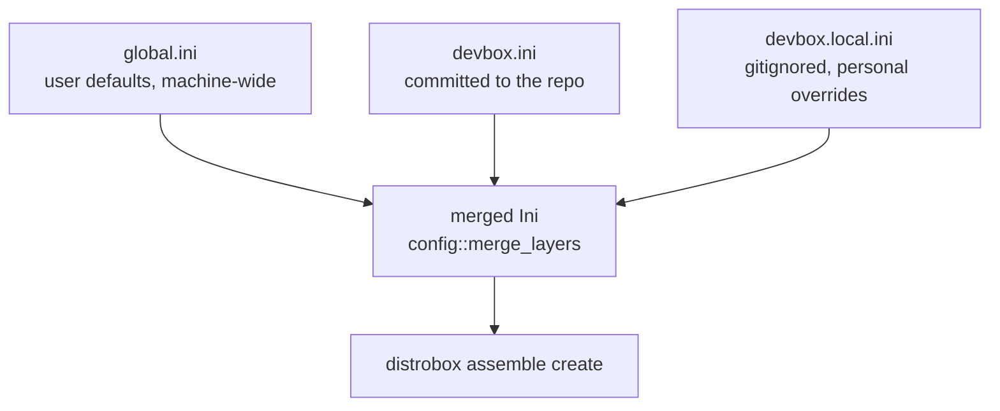
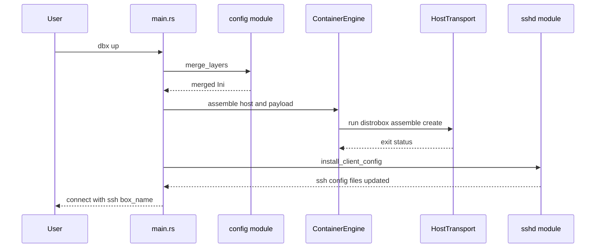
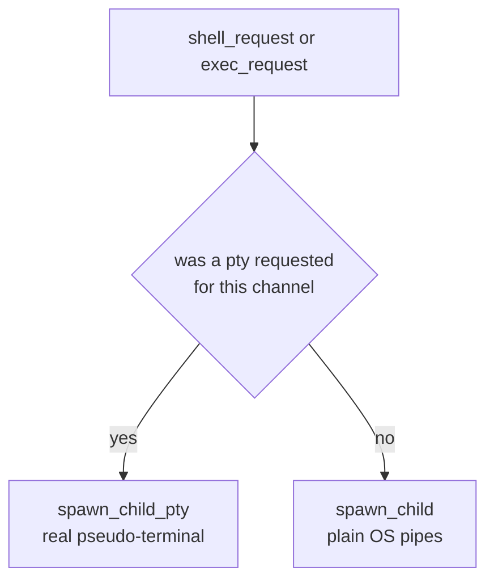

# Architecture

This document explains how dbx's codebase is organized, why it's organized that
way, and how to extend it (new platform, new container backend, new command) without
fighting the grain of the design.

If you only read one section, read [The two-axis design](#the-two-axis-design) — it's
the single idea that makes the rest of the codebase predictable.

---

## Goals that shaped the design

- **IDE-independent**: nothing here should assume a specific editor. The only
  "protocol" dbx exposes to the outside world is SSH.
- **Cross-platform without `#[cfg]` soup**: platform differences (Linux native, WSL2
  on Windows, Podman Machine/Lima on macOS) are isolated behind one trait, not
  scattered through `if cfg!(windows)` checks in business logic.
- **No lock-in to one container tool**: Distrobox is the only backend today, but
  nothing above the `ContainerEngine` trait should need to change if a second backend
  (e.g. Docker Compose) shows up later.
- **Small, single binary**: no daemon, no background service. Every command is a
  short-lived process; the only long-lived process is `ssh-proxy`, and only for the
  duration of one SSH session.

---

## Module map

```
src/
  main.rs        Entry point: parses CLI, builds AppContext, dispatches commands
  cli.rs         clap argument/subcommand definitions (no logic)
  context.rs     AppContext: merged config + detected host + selected engine
  util.rs        Small stateless helpers (quote-stripping, path resolution)

  config/        Layered INI parsing & merging (global -> project -> local)
  engine/        *What* container tool to drive
    mod.rs         ContainerEngine trait
    distrobox.rs   The only implementation today
  host/          *How* to run a command on this OS (compile-time target specialized)
    mod.rs         HostTransport trait + shared defaults + current() compile-time resolution
    linux.rs       Native Linux adapter (active on Linux; zero scratchpad overhead)
    windows.rs     WSL2 adapter + scratchpad integration (active on Windows)
    macos.rs       Podman Machine / Lima adapter (active on macOS)
    pty.rs         Cross-platform pseudo-terminal bridge (portable_pty <-> tokio)
    scratchpad.rs  WSL2 native-filesystem ext4 sync (rsync-based; active on Windows)
  sshd/          Embedded SSH server (keyless, no TCP listener)
    mod.rs         Server bootstrap + ~/.ssh/config management
    handler.rs     Per-session protocol handling (shell/exec/pty/data/...)

tests/
  cli.rs                     Hermetic black-box CLI tests (no container runtime needed)
  distrobox_integration.rs   Real container integration suite (up, stop, rm, init_hooks, RAII BoxGuard)
```

---

## The two-axis design

Every command dev-box runs has to answer two *independent* questions:

1. **What tool manages the container?** (today: Distrobox)
2. **How do I even run a shell command on this machine?** (native shell / WSL2 /
   a VM)

These are modeled as two separate traits so that neither axis knows the other exists:



`AppContext` (`context.rs`) picks one implementation of each trait at startup and
hands both to every command. A `ContainerEngine` never spawns a process directly —
it builds a *script string* (e.g. `"distrobox enter my-box"`) and asks whichever
`HostTransport` is active to actually run it:

```rust
// engine/distrobox.rs
fn enter(&self, host: &dyn HostTransport, box_name: &str, ...) -> Result<()> {
    let script = self.enter_script(box_name, None, forwarded_env, work_dir);
    host.run(&script, None)?;   // <- engine doesn't know or care if this is
    Ok(())                       //    sh -c, wsl.exe -e sh -c, or podman machine ssh
}
```

Because of this split, **any engine works on any host for free**. Adding a Docker
Compose backend wouldn't touch `host/` at all; adding a new platform wouldn't touch
`engine/` at all.

### Compile-Time Target Specialization (Zero Dead-Code Warnings)

Rust compiles ahead-of-time (AOT) to native machine code for the target architecture (`rustc --target`). A Windows executable (`dbx.exe`) is compiled specifically for Windows; a Linux binary is compiled specifically for Linux.

Because of this, `host/mod.rs` uses compile-time target gating (`#[cfg(target_os = "...")]`):
- When building on Windows, **only** `host/windows.rs` and `host/scratchpad.rs` are compiled into the binary.
- When building on Linux, **only** `host/linux.rs` is compiled into the binary.
- When building on macOS, **only** `host/macos.rs` is compiled into the binary.

This provides two critical advantages:
1. **Zero dead code warnings**: Unused platform adapters are never compiled into another OS's binary, completely eliminating the need for `#[allow(dead_code)]` hacks across the codebase.
2. **Zero runtime OS guessing**: `host::current()` statically binds the platform transport at compile time rather than probing the OS at runtime.

### `HostTransport`: one required method, default execution & scratchpad hooks

Every platform adapter defines **one** required method (`command_parts`), and all execution helpers (`run`, `capture`, `spawn_piped`, `spawn_pty`) are default methods implemented on top of it.

Furthermore, filesystem scratchpad synchronization is encapsulated as polymorphic hooks directly on `HostTransport`:



| Platform | `command_parts("distrobox list")` returns | Scratchpad Sync Behavior |
|---|---|---|
| Linux (native) | `("sh", ["-c", "distrobox list"])` | **No-op** (Host ext4 is already native container storage; zero sync overhead) |
| Windows (WSL2) | `("wsl.exe", ["-e", "sh", "-c", "distrobox list"])` | **Active** (Rsyncs between Windows NTFS `/mnt/c` and native WSL2 ext4 `/tmp/dbx/scratchpads`) |
| macOS (Podman Machine) | `("podman", ["machine", "ssh", "distrobox list"])` | Future VM shared-folder bridge |
| macOS (Lima) | `("limactl", ["shell", "default", "sh", "-c", "distrobox list"])` | Future VM shared-folder bridge |

Because scratchpad operations are default no-op methods on `HostTransport`, **`src/main.rs` contains zero `cfg!(target_os = "windows")` checks**. The application commands simply call `ctx.host.sync_to_scratchpad(&cwd, &box_name)` without needing to know which OS they are running on.

`macos.rs` is the one adapter that's an `enum` instead of a unit struct, because it's
the only platform that has to pick *between* two backends at runtime
(`MacHost::detect()` probes for `podman`, falls back to `limactl`). That's inherent to
the platform, not an inconsistency in the design.

---

## The Orchestrator vs. Executor Boundary: Rust & Bash

A key architectural question in cross-platform container tooling is where to draw the boundary between compiled system code and shell execution. `dbx` maintains a strict division of responsibilities:

* **Rust is the Orchestrator (The Brain)**: Handles configuration layering, argument parsing, OS-specific transport detection, keyless SSH protocol handling, pseudo-terminal allocation, and concurrency.
* **Bash/POSIX Shell is the Executor (The Muscle)**: Handles container lifecycle commands inside the Linux environment.

```mermaid
flowchart LR
    subgraph Rust["Rust (The Orchestrator)"]
        CLI["CLI Parsing (clap)"]
        Config["Config Merging (INI layers)"]
        SSH["Embedded SSH Server & Keyless Config"]
        PTY["PTY Allocation & Tokio Channels"]
        Transports["Cross-Platform Bridge (WSL2 / VM / Native)"]
    end

    subgraph Boundary["The Contract (POSIX Shell Script String)"]
        Script["'distrobox enter my-box -- sh -c ...'"]
    end

    subgraph Bash["Bash (The Linux Executor)"]
        Distrobox["Distrobox Engine (upstream shell script)"]
        Container["Container Namespaces & Cgroups (Podman / Docker)"]
        GuestEnv["Environment Variables & Shell Session"]
    end

    Rust --> Boundary --> Bash
```



### Why Rust as the Orchestrator?
1. **Single Self-Contained Binary**: Compiles into a single ~2MB static binary with zero external dependencies. On Windows, developers do not need `bash` or cygwin/MSYS installed on the host to run `dbx.exe`.
2. **Type Safety & Robust Error Handling**: Config merges, command dispatching, and file lock operations benefit from Rust's static typing and `Result<T, E>` propagates errors cleanly.
3. **Async Concurrency & Networking**: The embedded SSH server (`sshd/`) and PTY bridging (`portable_pty` onto Tokio channels) require multithreaded runtime management that shell scripts cannot provide safely.

### Why Bash as the Linux Executor?
1. **Distrobox is Upstream POSIX Shell**: The upstream `distrobox` project is an open-source POSIX shell script (`#!/bin/sh`), not a compiled binary. It relies on standard host shell tools.
2. **Cross-VM Bridges Expect Shell Strings**: Hypervisors and remote executors (`wsl.exe -e`, `limactl shell`, `podman machine ssh`, OpenSSH `ProxyCommand`) transfer command lines across hypervisor boundaries as shell strings, not OS `argv` pointer arrays.
3. **Shell Builtins & Compound Expressions**: Existence probes (`command -v distrobox`) rely on shell builtins. Compound commands (`cd /tmp/scratch && distrobox enter ...`) execute naturally in a shell without multiple process round-trips.

### Why Bash Commands are Generated Dynamically in Rust
Rather than storing external `.sh` script files on disk, `dbx` generates POSIX command strings dynamically in memory:
- **Zero Asset Distribution**: No loose `.sh` files to package, locate, or install on the host.
- **Safe Escaping**: Dynamic arguments (box names, environment variables, work directories) are sanitized through `shell_quote()`, preventing injection attacks or broken paths with spaces.
- **Streaming Payloads**: Payloads (such as INI configs for `distrobox assemble create --file /dev/stdin`) are generated in memory and piped directly to the host process stdin without touching temporary disk files.

---

## Configuration layering

`devbox.ini` is deliberately INI, not YAML/TOML/JSON, because it merges predictably
and diffs cleanly in code review. Layers are merged in ascending priority — later
layers win on scalar keys, and specific keys (`additional_packages`, `init_hooks`,
`exported_apps`, `forward_env`) are *additive* (space-joined) instead of overwritten:



`--config <path>` (repeatable, in `cli.rs`) replaces this default cascade entirely,
which is also how `sshd::install_client_config` pins the exact layer set into the
generated `ProxyCommand` — so `ssh <box>` run by an IDE from an arbitrary working
directory always resolves the same configuration `dbx up` used.

---

## Command flow: `dbx up`



`install_client_config` acquires an OS file lock (`sshd::with_ssh_config_lock`) before
touching either file, so two `dbx up`/`dbx rm` invocations for different boxes
never interleave their read-modify-write of the same config files.

---

## Command flow: interactive `ssh <box>`

This is the part of the system with the least visible control flow, since it's driven
by whatever the SSH client decides to send. `ssh-proxy` never opens a TCP listener —
it's spawned locally as an SSH `ProxyCommand` and speaks the protocol over its own
stdin/stdout.

```mermaid
sequenceDiagram
    participant Client as SSH client
    participant Proxy as dbx ssh-proxy
    participant Host as HostTransport
    participant Box as distrobox container

    Client->>Proxy: spawned via ProxyCommand, stdio pipe only
    Proxy->>Client: auth_none accepted
    Client->>Proxy: pty_request with cols and rows
    Proxy->>Proxy: remember requested pty size for this channel
    Client->>Proxy: shell_request or exec_request
    alt pty was requested
        Proxy->>Host: spawn_pty with the enter script and size
        Host->>Box: distrobox enter, attached to a real pty
    else no pty requested
        Proxy->>Host: spawn_piped with the enter script
        Host->>Box: distrobox enter, plain OS pipes
    end
    Box-->>Proxy: stdout and stderr
    Proxy-->>Client: channel data
    Client->>Proxy: data, keystrokes or stdin
    Proxy->>Box: forwarded to the child's stdin
    Box-->>Proxy: exit status
    Proxy-->>Client: exit status, eof, close
```

The pty-vs-piped choice happens once per channel and mirrors real OpenSSH semantics:



A pty is only allocated when the client actually asks for one — an interactive
`ssh <box>` or `ssh -t <box> cmd` gets `vim`/`htop`/job control working correctly; a
plain scripted `ssh <box> cmd` (no `-t`) stays on the lighter, non-interactive pipe
path, exactly like talking to a real `sshd`.

---

## Extending dbx

### Add a new platform (e.g. FreeBSD, or a remote-SSH-host transport)

1. Create `src/host/<platform>.rs` implementing `HostTransport`:

   ```rust
   use super::HostTransport;
   use anyhow::Result;

   pub struct MyPlatformHost;

   impl HostTransport for MyPlatformHost {
       fn name(&self) -> &'static str {
           "my-platform"
       }

       fn command_parts(&self, script: &str) -> Result<(String, Vec<String>)> {
           Ok(("sh".to_string(), vec!["-c".to_string(), script.to_string()]))
       }
   }
   ```

   That's it — `run`, `capture`, `spawn_piped`, and `spawn_pty` (real PTY support) all
   come for free from the default methods in `host/mod.rs`. Only override them if your
   platform genuinely can't support one (e.g. no pty concept at all).

2. Register it in `host::current()` behind the right `#[cfg(target_os = "...")]`.
3. Add a unit test for `command_parts` (see `host/linux.rs`'s neighbors for the
   pattern) and, if the platform is available in CI, let `tests/cli.rs` exercise it
   for free (those tests are already platform-agnostic).

### Add a new container backend (e.g. Docker Compose)

1. Create `src/engine/<backend>.rs` implementing `ContainerEngine`
   (`name`, `is_available`, `assemble`, `enter`, `enter_script`, `list`, `stop`, `rm`).
   Use `engine/distrobox.rs` as the template — note it never touches `std::process`
   directly, only ever calls `host.run(...)`/`host.capture(...)` with a script string.
2. Pick the engine in `AppContext::new` (`context.rs`) — today it's hardcoded to
   `DistroboxEngine`; a multi-backend future would read a config key here instead.
3. No changes needed anywhere in `host/` or `sshd/` — both only depend on the
   `ContainerEngine` trait, never on `DistroboxEngine` specifically.

### Add a new CLI command

1. Add a variant to `Command` in `cli.rs` (clap derives the parser from the enum).
2. Add a matching arm in `main.rs`'s `match cli.command`. Reach for `ctx.host`,
   `ctx.engine`, `ctx.config` — `AppContext` already has everything most commands need.

---

## Testing strategy

| Layer | Where | What it covers | Needs a container runtime? |
|---|---|---|---|
| Unit tests | `#[cfg(test)]` modules next to the code (`config/mod.rs`, `util.rs`, `engine/distrobox.rs`, `sshd/mod.rs`, `host/pty.rs`, `host/linux.rs`) | Pure logic: INI merging, shell quoting, SSH-config block insert/remove, pty size clamping, host command formatting | No |
| CLI black-box tests | `tests/cli.rs` | `dbx config`, `dbx up --dry-run`, argument validation -- spawns the real binary, never touches Distrobox | No |
| Real End-to-End Integration tests | `tests/distrobox_integration.rs` (`#[ignore]`d by default) | Full container lifecycle (`up`, `stop`, `rm`), `init_hooks` execution, `~/.ssh/dbx_config` management | Yes |

### Integration Suite Design (`tests/distrobox_integration.rs`)
- **`up_then_rm_round_trip`**: Assembles a real container, verifies `dbx list` detects it, confirms `~/.ssh/dbx_config` has the managed `Host` block, then tests clean removal.
- **`stop_and_cleanup_round_trip`**: Verifies container shutdown with `dbx stop` followed by teardown.
- **`custom_config_assembly_round_trip`**: Validates assembly with custom `init_hooks` executed inside Distrobox.
- **`list_succeeds_when_distrobox_is_installed`**: Smoke tests query commands against live Distrobox.
- **`BoxGuard` RAII Pattern**: Every test creates a `BoxGuard` holding the box name and directory. Its `Drop` implementation guarantees `dbx rm --force` and directory cleanup execute even if an assertion panics, preventing orphaned containers on the host.

Run hermetic tests with `cargo test`. Run the real E2E integration suite with:
```sh
cargo test --test distrobox_integration -- --ignored --test-threads=1
```
In CI, `.github/workflows/ci.yml`'s `integration` job provisions Podman and Distrobox on Ubuntu and enforces these integration tests as a required merge gate.

---

## Non-goals (for now)

- **No daemon.** Every command is a fresh process. If dbx ever needs persistent
  state beyond `~/.ssh/config`, that's a deliberate architecture change, not an
  incremental one.
- **No plugin system.** Both `HostTransport` and `ContainerEngine` are closed sets of
  Rust types chosen at compile time via `#[cfg]`/hardcoding, not a dynamically loaded
  plugin API. That's intentional for a single ~2MB static binary with no runtime
  dependency resolution.
